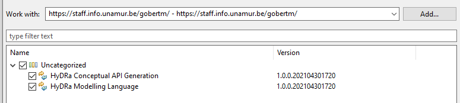
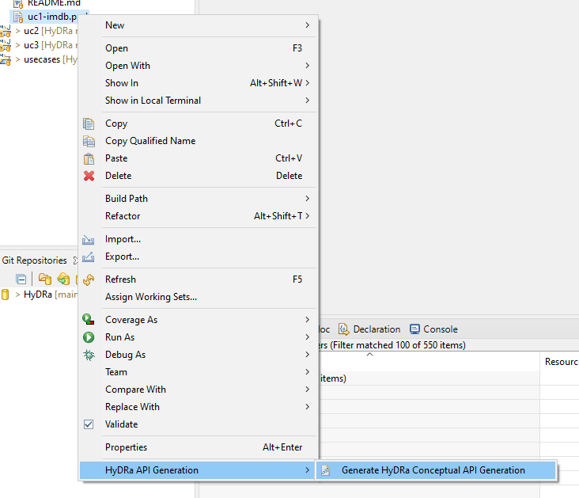
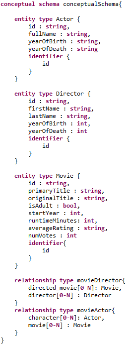
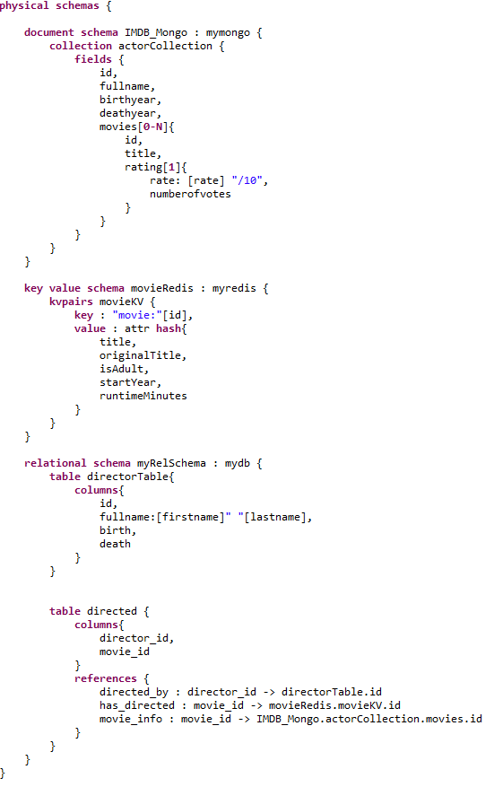
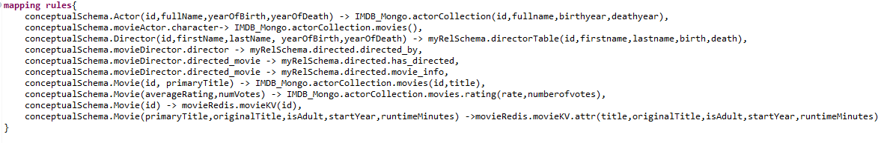
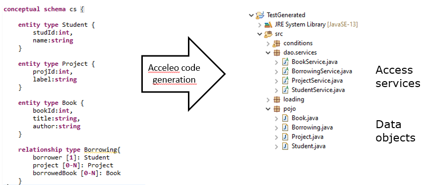

# HyDRa
HyDRa (Hybrid Data Representation and Access) is a hybrid polystore management framework providing a modeling language and a conceptual API generation tool.

Modeling language provides support for relational database (MySQL, MariaDB), document database (MongoDB), key value stores (Redis), graph database (Neo4j) and column database (Cassandra).

Based on the designed model a data manipulation API can be generated.

### API Operations Supported
Here we list the operations manipulating modeled domain entities objects supported by the generated API.

| Feature | Relational DB | Document DB | Key Value DB | Graph DB | Column DB |
|----|:---:|:---:|:---:|:---:|---|
| `Read ` | 🌕 | 🌕 | 🌔 (only supports string, hash and lists datatypes) | 🌑 | 🌑 |
| `Insert` | 🌕 | 🌕 | 🌓 (only for structures not mapped to roles) | 🌑 | 🌑 |
| `Update` | 🌑 | 🌒 (via insert of embedded entities) | 🌑 | 🌑 | 🌑 |
| `Delete` | 🌑 | 🌑 | 🌑 | 🌑 | 🌑 |

## Install

**A video of the installation and usage of HyDRa tools is available [here](https://github.com/gobertm/HyDRa/raw/main/Use-Cases/resources/Video-Installation-Usage.mp4) or on [youtube](https://youtu.be/-Auy5prYMOw)**

-   Make sure Java 14 is installed on your computer
-   Run Eclipse and install the HyDRa plugins
    -   Help > Install New Software > Add > https://staff.info.unamur.be/gobertm/
-   Restart Eclipse. (Note that in some cases the API generation tool requires a second restart of Eclipse)

## Usage
-   Create a new Maven project or import a pre-existing project in [Use-Cases](Use-Cases/) folder.
    -   Please make sure Eclipse uses the Java 14 compiler. Properties > Build path > Select Java 14 JRE. 
    And Properties > Java Compiler > Compiler Compliance Level.
-   Design your HyDRa polystore schema. Create New File > *.pml file extension.
-   Generate the conceptual API code by right-clicking on the .pml file > HyDRa API Generation > Generate HyDRa Conceptual API. Note that if no file is generated, it may be necessary to restart Eclipse and to try again.

## Troubleshoot
-   When clicking on 'Generate HyDRa Conceptual API generation' nothing happens.
> Try restarting Eclipse.
- My project is full of compilation errors. 
> Make sure the source containing folders are correctly set in project build path. Build Path > Configure Build path > Source . 2 folders should be listed *project*/src/main/java & *project*/src/main/java

## Use-Cases 

-   [uc1-imdb](Use-Cases/uc1-imdb) is a complete use case illustrating all functionalities and benefits of the HyDRa framework.
-   [uc2-datainconsistency](Use-Cases/uc2-datainconsistency) is a use case focusing on the data inconsistency discovery feature of HyDRa.
-   [uc3-hybridrelation](Use-Cases/uc3-hybridrelation) further illustrates the handling of hybrid data model references.

## Design of polystore

The HyDRa polystore modeling language was written using Xtext, see [Concrete Syntax](be.unamur.polystore/src/be/unamur/polystore/Pml.xtext)
Below we provide an instantiation example of the three main sections of a HyDRa polystore schema:
1.  The Conceptual Schema section represents the application domain model of the polystore;
2.  The Physical Schema section allows the definition of the physical data structures;
3.  The Mapping Rules section expresses the links between conceptual schema elements and physical schema elements.

 

## API Generation

The HyDRa framework also includes a conceptual access API generation process.
A HyDRa polystore schema is given as input of this process. The generation itself is implemented using an Acceleo-based tool (see [acceleo sources](be.unamur.polystore.acceleo)) which generates object classes and data manipulation classes. The API generation tool can be launched by right-clicking on a .pml HyDRa polystore schema.

