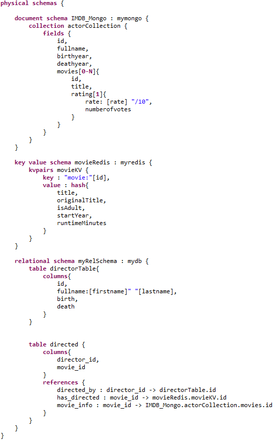

# Example Use Case

## IMDB
### **How-to**
-   To deploy the polystore databases and load their respective data, run 'docker-compose up' in /data-deployment folder. This may take around 10 minutes. The deployment is complete when the mysql docker has successfully run *3-directorTable.sql*
-   Import an existing project or create a new one and generate the conceptual API using [uc1-imdb.pml](uc1-imdb.pml).
-   Play with the the invocation of the generated API to access the polystore data using [Test Class](https://github.com/gobertm/HyDRa/blob/main/Use-Cases/uc1-imdb/src/test/java/IMDBTests.java)

### **Description**
This use case is the one presented in our ER 2021 paper submission.
It is based on a subset of the IMDB movie dataset https://www.imdb.com/interfaces/.
Below we give a detailed description of the conceptual and physical schemas and of the mapping rules between them.
The key points are the following :
- *actorCollection* in the **IMDB_Mongo** document database contains all data about actors with an embedded array *movies*, which contains their 3 most known movies (data coming from *knownForTitles* of **name.basics.tsv** IMDB file)
- *movies* array elements includes an embedded object of (randomly generated) ratings information. 
- **movieRedis** is a key-value database that contains data only for the movies released in 2010. 
- **movieRedis** is the only database containing the movie attributes *originalTitle*, *isAdult*, *startYear* and *runtimeMinutes*.
- *fullname* column in the *directorTable* of the relational database is a composed field, made of the concatenation of the *firstname* and *lastname* conceptual attributes.
- *directed* is a join table between *director* and *movies*, that contains two columns used by three references/foreign keys. *director_id* references another table in the same database; while *movie_id* references the movie info in both the **IMDB_Mongo** and **movieRedis** databases.

### **Results** 

- [testGetAllMovies](https://github.com/gobertm/HyDRa/blob/267cad53c515d85506eb3eecbbddc5124208ae6d/Use-Cases/uc1-imdb/src/test/java/IMDBTests.java#L28) returns all the *Movie* instances found in all databases. It reconstructs a complete conceptual *Movie* object, joining data from the embedded array structures of **actorCollection** and from the **movieRedis** key value structures.
The retrieved dataset of *Movie* objects can be split in two parts.
1. The movies of 2010, which are also contained in the redis key-value database, have values for all conceptual attributes.
 
2. The other instances of movies only have attributes values found in the *actorCollection* 

- [testGetActorByMovieDirector](https://github.com/gobertm/HyDRa/blob/267cad53c515d85506eb3eecbbddc5124208ae6d/Use-Cases/uc1-imdb/src/test/java/IMDBTests.java#L40) is a complete example of how one can retrieve a set of actors who played in film directed by a particular director.
The main steps are the following :
1.  Build a condition object, expressing specific values for the particular *Director*'s attributes.
2.  Query the director data based on this condition.
3.  Retrieve the *movie*s objects of this particular director, by exploiting the declared conceptual relationship *movieDirector* , and particularly its role *directed_movie*.
4.  For each of this movies, retrieve the *Actor*s, using the *character* role of the *movieActor* relationship.
### Conceptual Schema 

### Physical Schema

### Mapping Rules

