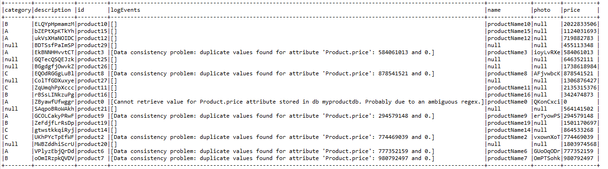
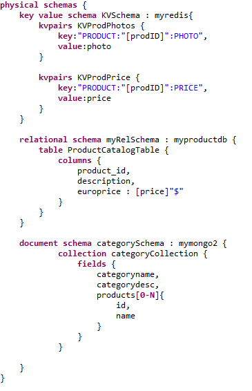

# Example Use Case

## Data-inconsistency

### How-to

-   To deploy databases and data, run 'docker-compose up' in /data-deployment folder.
-   Import project or create a new one and generate API using [uc2-datainconsistency.pml](uc2-datainconsistency.pml).
-   Run `getAllProducts` test of [Test Class](https://github.com/gobertm/HyDRa/blob/main/Use-Cases/uc2-datainconsistency/src/test/java/DataInconsistenciesTests.java)

### Description
In this example we illustrate the data inconsistency discovery across databases for a common entity type.

According the the mapping rules declared in data-inconstency.pml, *Product* entity type is spread among *KVSchema* key value database, *myRelSchema* relational database and in an embedded document in *categorySchema* document database.

Moreover, as specified in the model (see below), the column *dollarprice* is a composed field of *price* attribute and *$* sign.

We introduced two different cases of data consistency problems to the model :
1.  In the data deployed *price* data for *Product id* 0 to 10 is different in *KVProdPrice* than the one in *ProductCatalogTable*.
2.  *product0* Product price data in *ProductCatalogTable* is not compliant with the specified composed field. Price data does not contain *$*.

Running `getAllProducts` test in [Test Class](https://github.com/gobertm/HyDRa/blob/main/Use-Cases/uc2-datainconsistency/src/test/java/DataInconsistenciesTests.java) will retrieve all found products, join them and identify described data inconsistencies.
Logger lines will spot inconsistencies :

    WARN  ProductService:153 - data consistency problem: duplicate values for attribute : 'Product.price' ==> 1700927051 and 0
    WARN  ProductServiceImpl:384 - Cannot retrieve value for Productprice attribute stored in db myproductdb. Probably due to an ambiguous regex.

A show of the retrieved datasets gives the following result (only 20 rows) :

### Model 

