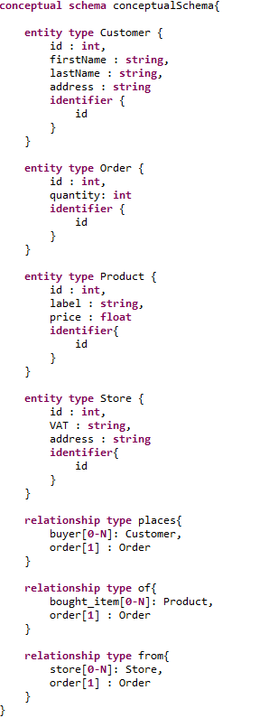
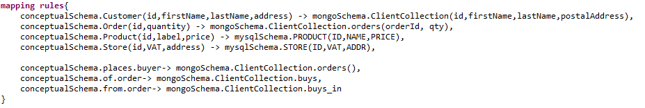

# Example Use Case

## Hybrid relation

### How-to

-   To deploy databases and data, run 'docker-compose up' in /data-deployment folder.
-   Import project or create a new one and generate API using [uc3-hybridrel.pml](uc3-hybridrel.pml).
-   Run `testGetBiggestDuffBeerConsumer()` test of [Test Class](src/test/java/Test.java)

### Description
In this example we illustrate of we can use the conceptual API to perform more complex queries on multi databases data by exploiting role based selection methods.

The conceptual schema of this use cases consists in *Customer*, *Order*, *Product* and *Store* entity types. (See conceptual schema figure below)
*Customer* **places** *Order*, Customer data are placed in a document database, with their orders as nested objects in *orders* array. *Orders* are **of** *Product* 
Each order in this array contains reference attributes *productId* and *storeId*, which respectively targets columns *ID* in *PRODUCT* table of relational schema *mysqlSchema* and *ID* of *STORE* table in the relational schema. (See physical schema and mapping rules below).

In [Test Class](src/test/java/Test.java) we  :
1.  Retrieve all *Order*s involved in relationship type *of* and by giving a condition on *Product* , [Line 32](https://github.com/gobertm/HyDRa/blob/d7dfd92ae3bcf25fe0483e1947fa5d77a8b2c341/Use-Cases/uc3-hybridrelation/src/test/java/Test.java#L32)
2.  Sort the retrieved orders by quantity in descending order using built in Spark functions.
3.  Retrieve the first order of the ordered list.
4.  Exploit the other hybrid relationship type *places* to select the *Customer* of this particular order, [Line 40](https://github.com/gobertm/HyDRa/blob/d7dfd92ae3bcf25fe0483e1947fa5d77a8b2c341/Use-Cases/uc3-hybridrelation/src/test/java/Test.java#L40)

### Model 

